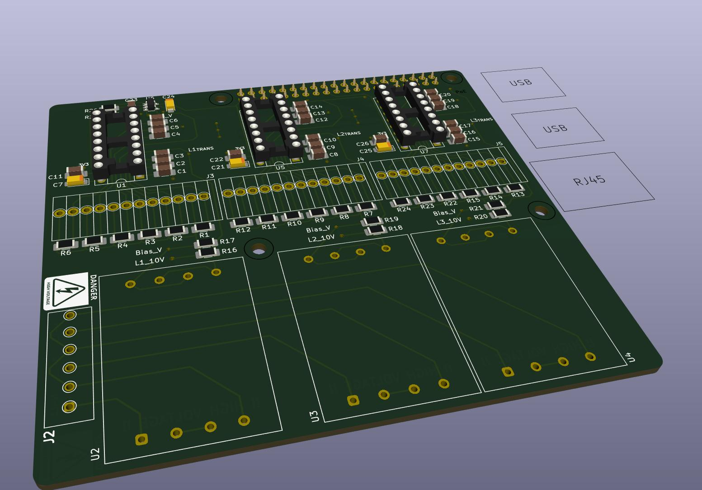

# ----- W.I.P -----
# Raspberry-Pi Energy Meter HAT

## What does it do?
This PCB is designed for measuring electrical current across three phases, with 6 individual channels per phase. Each channel represents a separate current path and uses current transformers (CTs) for sensing. The board uses 22 Ohm burden resistors for each CT channel.

Additionally, the board incorporates transformers to step down the mains voltage to a measurable level for voltage monitoring. **Caution:** This board operates with potentially dangerous voltages. There is **no touch protection**, and **improper handling may result in electric shock**.

This is a DIY project and comes with **no warranty or guarantee** of safety or performance. Use at your own risk.  
I personally have this setup running now for 2 years.

## Pictures of running setup

